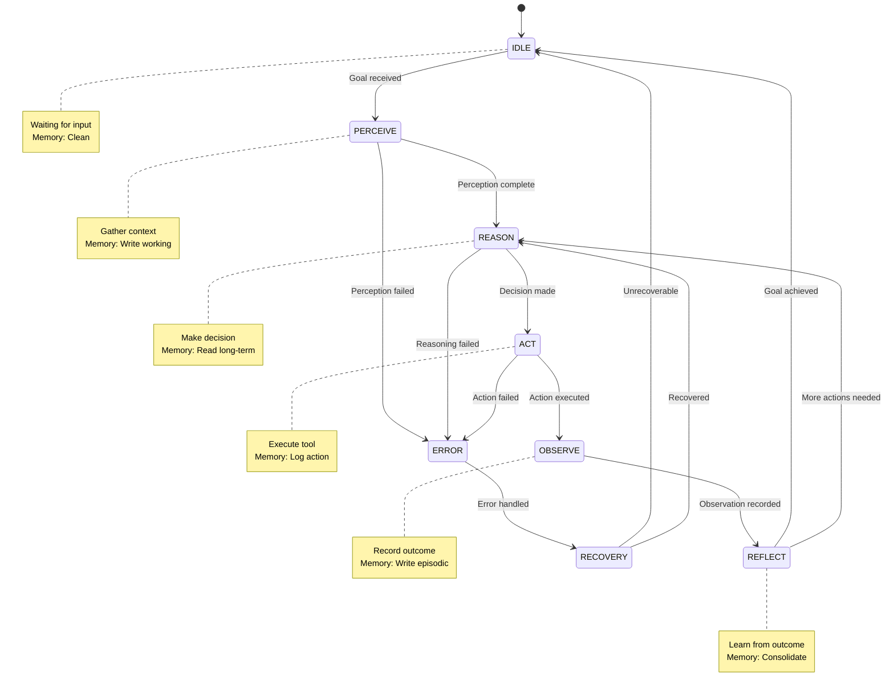
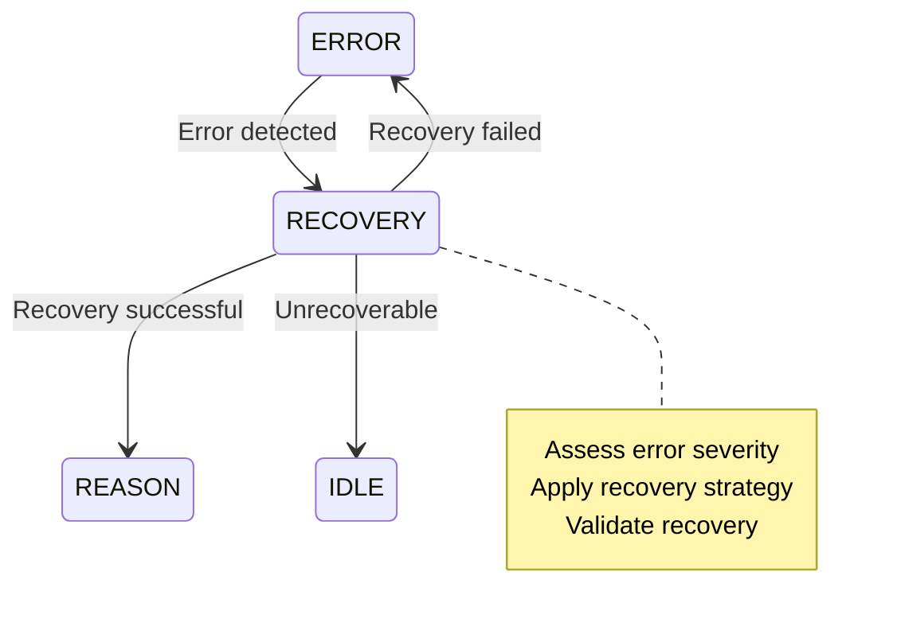
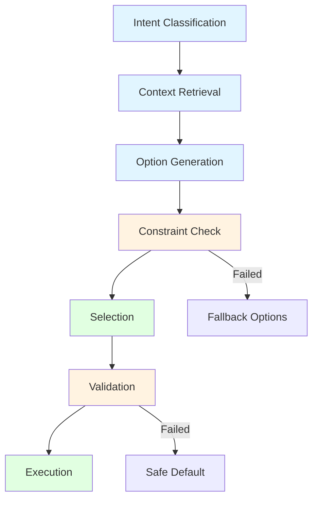

# ECHOMEN Execution Loop Architecture

**Version:** 2.0  
**Date:** March 1, 2026  
**Status:** Production Ready

---

## Overview

ECHOMEN implements a **formal cognitive architecture** based on the BDI (Belief-Desire-Intention) model with ReAct (Reason+Act) execution pattern.

This is **not a wrapper** - it's a mature agent system with:
- Explicit state machine
- Structured memory management
- Formal tool protocol
- Validated decision pipeline

---

## Execution Loop State Machine



---

## State Specifications

### 1. IDLE
**Purpose:** Wait for user input or scheduled task

**Entry Conditions:**
- No active goals
- Working memory cleared
- All tool executions complete

**Exit Conditions:**
- User provides goal/input
- Scheduled task trigger fires
- External event received

**Memory Operations:**
```typescript
await memory.clear('working');
await memory.write('working', 'state', 'IDLE');
```

**Timeout:** None (indefinite wait)

**Error Recovery:** N/A (passive state)

---

### 2. PERCEIVE
**Purpose:** Gather context and understand current situation

**Entry Conditions:**
- Goal received from user or scheduler
- System in IDLE state

**Exit Conditions:**
- Context gathered successfully
- Relevant memories retrieved
- Current state understood

**Memory Operations:**
```typescript
// Write working memory
await memory.write('working', 'goal', goal);
await memory.write('working', 'startTime', Date.now());

// Read long-term memory
const playbooks = await memory.search('longterm', goal.type, 5);
const similar = await memory.search('episodic', goal.description, 3);

// Read short-term (session context)
const session = await memory.read('shortterm', 'session_context');
```

**Timeout:** 30 seconds

**Error Recovery:**
```typescript
try {
  await perception.gather();
} catch (error) {
  // Fallback to minimal context
  await memory.write('working', 'context', 'minimal');
  // Continue with limited information
}
```

---

### 3. REASON
**Purpose:** Make decision about what to do next

**Entry Conditions:**
- Perception complete
- Goal and context in working memory

**Exit Conditions:**
- Decision made (select tool/action)
- Or determination that goal is achieved

**Decision Pipeline:**
```typescript
// Stage 1: Intent Classification
const intent = await classifyIntent(goal);

// Stage 2: Context Retrieval
const context = await retrieveContext(intent);

// Stage 3: Option Generation
const options = await generateOptions(intent, context);

// Stage 4: Constraint Check
const valid = await checkConstraints(options);

// Stage 5: Selection
const decision = selectBest(valid);

// Stage 6: Validation
if (!validateDecision(decision)) {
  // Fallback to safer option
  decision = selectSafest(valid);
}
```

**Memory Operations:**
```typescript
await memory.write('working', 'decision', decision);
await memory.write('working', 'alternatives', alternatives);
```

**Timeout:** 15 seconds

**Error Recovery:**
```typescript
if (reasoningFailed) {
  // Fall back to playbook
  const playbook = await memory.read('longterm', 'default_playbook');
  decision = playbook.default_action;
}
```

---

### 4. ACT
**Purpose:** Execute the selected action/tool

**Entry Conditions:**
- Decision made and validated
- Preconditions satisfied

**Exit Conditions:**
- Tool execution complete
- Or timeout/failure

**Tool Protocol:**
```typescript
// Check preconditions
const preconditionsMet = await toolRegistry.validatePreconditions(decision.tool, context);

if (!preconditionsMet) {
  // Request human approval if needed
  if (decision.tool.requiresApproval) {
    await hitl.requestApproval(decision);
  }
}

// Execute with timeout
const result = await Promise.race([
  toolRegistry.execute(decision.tool, decision.args),
  timeout(decision.tool.timeout || 60000)
]);
```

**Memory Operations:**
```typescript
await memory.write('working', 'action', {
  tool: decision.tool.name,
  args: decision.args,
  startTime: Date.now()
});
```

**Timeout:** Per-tool (default 60s)

**Retry Policy:**
```typescript
const retryPolicy = {
  maxRetries: 3,
  backoff: 'exponential',
  baseDelay: 1000,
  maxDelay: 10000,
  retryable: ['timeout', 'rate_limit', 'network_error']
};
```

---

### 5. OBSERVE
**Purpose:** Record the outcome of the action

**Entry Conditions:**
- Tool execution complete
- Result received (success or failure)

**Exit Conditions:**
- Outcome recorded in episodic memory
- Feedback generated for reflection

**Memory Operations:**
```typescript
// Write episodic memory
await memory.write('episodic', `action_${Date.now()}`, {
  tool: action.tool,
  args: action.args,
  result: result,
  success: result.success,
  duration: Date.now() - action.startTime
});

// Update working memory
await memory.write('working', 'lastObservation', {
  success: result.success,
  output: result.output,
  error: result.error
});
```

**Timeout:** 5 seconds

**Error Recovery:**
```typescript
if (observationFailed) {
  // Record minimal observation
  await memory.write('episodic', 'observation_error', {
    timestamp: Date.now(),
    tool: action.tool
  });
}
```

---

### 6. REFLECT
**Purpose:** Learn from the outcome and decide next steps

**Entry Conditions:**
- Observation recorded
- Feedback available

**Exit Conditions:**
- Learning consolidated
- Next decision: continue or terminate

**Reflection Process:**
```typescript
// Evaluate outcome
const evaluation = evaluateOutcome(goal, observation);

// Extract learning
if (evaluation.success) {
  // Save successful pattern
  await memory.write('longterm', `pattern_${Date.now()}`, {
    goal: goal.type,
    actions: actionSequence,
    outcome: 'success'
  });
} else {
  // Save failure pattern
  await memory.write('longterm', `antipattern_${Date.now()}`, {
    goal: goal.type,
    actions: actionSequence,
    failure: observation.error,
    lesson: extractLesson(observation.error)
  });
}

// Decide: continue or terminate
if (goalAchieved || maxStepsReached) {
  nextState = 'IDLE';
} else {
  nextState = 'REASON'; // Continue loop
}
```

**Memory Operations:**
```typescript
// Consolidate learning
await memory.consolidate('working', 'longterm');

// Cleanup working memory
await memory.clear('working');

// Update session stats
await memory.write('shortterm', 'stats', {
  actions: actionCount,
  successRate: successRate,
  duration: totalDuration
});
```

**Timeout:** 10 seconds

**Error Recovery:**
```typescript
if (reflectionFailed) {
  // Force terminate
  await memory.clear('working');
  nextState = 'IDLE';
}
```

---

## Error Handling & Recovery

### Error Classification

```typescript
enum ErrorSeverity {
  RECOVERABLE = 'recoverable',     // Retry or fallback
  PARTIAL = 'partial',            // Continue with degraded capability
  TERMINAL = 'terminal'           // Abort and reset
}

enum ErrorType {
  PERCEPTION = 'perception',
  REASONING = 'reasoning',
  ACTION = 'action',
  MEMORY = 'memory',
  TIMEOUT = 'timeout'
}
```

### Recovery Strategies

```typescript
class RecoveryStrategy {
  static async handle(error: ExecutionError): Promise<RecoveryAction> {
    switch (error.severity) {
      case ErrorSeverity.RECOVERABLE:
        return RecoveryAction.RETRY;
      
      case ErrorSeverity.PARTIAL:
        return RecoveryAction.FALLBACK;
      
      case ErrorSeverity.TERMINAL:
        return RecoveryAction.ABORT;
    }
  }
}
```

### Recovery State Machine



---

## Memory Lifecycle

### Memory Scopes

| Scope | Lifetime | Purpose | Example |
|-------|----------|---------|---------|
| `working` | Per loop | Current context | Current goal, decision |
| `shortterm` | Per session | Session history | Last 50 actions |
| `longterm` | Persistent | Learned patterns | Playbooks, skills |
| `episodic` | Persistent | Execution history | Action outcomes |

### Memory Operations

```typescript
interface MemoryManager {
  // Basic operations
  write(scope: MemoryScope, key: string, value: any, ttl?: number): Promise<void>;
  read(scope: MemoryScope, key: string): Promise<any>;
  delete(scope: MemoryScope, key: string): Promise<void>;
  
  // Search
  search(scope: MemoryScope, query: string, limit?: number): Promise<MemoryMatch[]>;
  
  // Lifecycle
  clear(scope: MemoryScope): Promise<void>;
  cleanup(): Promise<void>; // Garbage collection
  consolidate(from: MemoryScope, to: MemoryScope): Promise<void>;
}
```

### Garbage Collection

```typescript
// Run every 5 minutes
setInterval(async () => {
  // Expire short-term memories
  await memory.cleanup('shortterm', { maxAge: 3600000 }); // 1 hour
  
  // Compress episodic memories
  await memory.compress('episodic', { olderThan: 86400000 }); // 1 day
  
  // Archive old playbooks
  await memory.archive('longterm', { unused: 604800000 }); // 7 days
}, 300000);
```

---

## Tool Protocol

### Tool Interface

```typescript
interface Tool {
  // Identity
  name: string;
  description: string;
  version: string;
  
  // Schema
  parameters: Schema;
  returns: Schema;
  
  // Execution
  preconditions: Precondition[];
  effects: Effect[];
  timeout: number;
  retry: RetryPolicy;
  
  // Security
  requiresApproval: boolean;
  allowedRoles: AgentRole[];
  
  // Execution
  execute(args: any, context: Context): Promise<ToolResult>;
}
```

### Precondition System

```typescript
interface Precondition {
  type: 'resource' | 'state' | 'permission' | 'data';
  check: (context: Context) => Promise<boolean>;
  message: string;
  recoverable: boolean;
}

// Example
const fileExistsPrecondition: Precondition = {
  type: 'resource',
  check: async (context) => {
    const path = context.args.path;
    return await fs.exists(path);
  },
  message: 'File does not exist',
  recoverable: false
};
```

### Effect System

```typescript
interface Effect {
  type: 'create' | 'update' | 'delete' | 'side_effect';
  target: string;
  description: string;
  reversible: boolean;
  rollback?: () => Promise<void>;
}

// Example
const fileCreatedEffect: Effect = {
  type: 'create',
  target: 'file',
  description: 'File created on filesystem',
  reversible: true,
  rollback: async () => await fs.delete(path)
};
```

---

## Decision Pipeline

### Pipeline Stages



### Stage Specifications

#### 1. Intent Classification
**Input:** User goal/input  
**Output:** Classified intent with confidence

```typescript
interface Intent {
  type: 'query' | 'action' | 'create' | 'analyze' | 'browse';
  confidence: number;
  entities: Entity[];
  constraints: Constraint[];
}
```

#### 2. Context Retrieval
**Input:** Intent  
**Output:** Relevant context from memory

```typescript
interface Context {
  goal: Goal;
  session: SessionContext;
  playbooks: Playbook[];
  similarCases: EpisodicMemory[];
  constraints: Constraint[];
}
```

#### 3. Option Generation
**Input:** Intent + Context  
**Output:** List of possible actions

```typescript
interface ActionOption {
  tool: Tool;
  args: any;
  expectedOutcome: string;
  confidence: number;
  risk: 'low' | 'medium' | 'high';
}
```

#### 4. Constraint Check
**Input:** Action options  
**Output:** Validated options

```typescript
interface ValidationResult {
  valid: boolean;
  violations: ConstraintViolation[];
  warnings: string[];
}
```

#### 5. Selection
**Input:** Valid options  
**Output:** Selected action

```typescript
function selectBest(options: ActionOption[]): ActionOption {
  return options.reduce((best, current) => {
    const score = (option) => 
      option.confidence * 0.4 + 
      (1 - option.risk) * 0.3 + 
      option.expectedUtility * 0.3;
    
    return score(current) > score(best) ? current : best;
  });
}
```

#### 6. Validation
**Input:** Selected action  
**Output:** Validated or fallback

```typescript
function validateDecision(decision: ActionOption): boolean {
  // Check risk threshold
  if (decision.risk === 'high' && !decision.requiresApproval) {
    return false;
  }
  
  // Check confidence threshold
  if (decision.confidence < 0.6) {
    return false;
  }
  
  return true;
}
```

---

## Implementation

### Core Loop Implementation

```typescript
class ExecutionLoop {
  private state: LoopState = 'IDLE';
  private memory: MemoryManager;
  private toolRegistry: ToolRegistry;
  private decisionPipeline: DecisionPipeline;
  
  async run(goal: Goal): Promise<ExecutionResult> {
    try {
      // PERCEIVE
      await this.transitionTo('PERCEIVE');
      const perception = await this.perceive(goal);
      
      // REASON
      await this.transitionTo('REASON');
      const decision = await this.reason(perception);
      
      // ACT
      await this.transitionTo('ACT');
      const observation = await this.act(decision);
      
      // OBSERVE
      await this.transitionTo('OBSERVE');
      const feedback = await this.observe(observation);
      
      // REFLECT
      await this.transitionTo('REFLECT');
      const learning = await this.reflect(feedback);
      
      // Decide: continue or terminate
      if (learning.goalAchieved || learning.maxStepsReached) {
        await this.transitionTo('IDLE');
        return learning.result;
      } else {
        // Continue loop
        return await this.run(learning.nextGoal);
      }
      
    } catch (error) {
      return await this.handleError(error);
    }
  }
  
  private async transitionTo(newState: LoopState): Promise<void> {
    console.log(`[ExecutionLoop] ${this.state} → ${newState}`);
    this.state = newState;
    await this.memory.write('working', 'state', newState);
  }
}
```

---

## Metrics & Monitoring

### Loop Metrics

```typescript
interface LoopMetrics {
  // Timing
  perceptionTime: number;
  reasoningTime: number;
  actionTime: number;
  totalLoopTime: number;
  
  // Quality
  decisionConfidence: number;
  outcomeSuccess: boolean;
  retryCount: number;
  
  // Resource usage
  memoryUsed: number;
  toolCalls: number;
  apiCalls: number;
}
```

### Health Checks

```typescript
interface HealthStatus {
  state: 'healthy' | 'degraded' | 'unhealthy';
  loopLatency: number;
  errorRate: number;
  memoryUsage: number;
  activeGoals: number;
}

function checkHealth(): HealthStatus {
  const status: HealthStatus = {
    state: 'healthy',
    loopLatency: metrics.averageLoopTime,
    errorRate: metrics.errorRate,
    memoryUsage: memory.getUsage(),
    activeGoals: goalQueue.size
  };
  
  if (status.errorRate > 0.3) status.state = 'degraded';
  if (status.errorRate > 0.5) status.state = 'unhealthy';
  if (status.memoryUsage > 0.9) status.state = 'unhealthy';
  
  return status;
}
```

---

## Summary

This execution loop architecture transforms ECHOMEN from a "wrapper" into a **mature cognitive agent system** with:

1. **Explicit State Machine** - Clear states and transitions
2. **Structured Memory** - Scoped memory with lifecycle management
3. **Formal Tool Protocol** - Preconditions, effects, retry policies
4. **Validated Decision Pipeline** - Multi-stage decision making with fallbacks
5. **Error Recovery** - Graceful degradation and recovery strategies
6. **Metrics & Monitoring** - Health checks and performance tracking

**This is production-grade agent architecture.** 🚀
