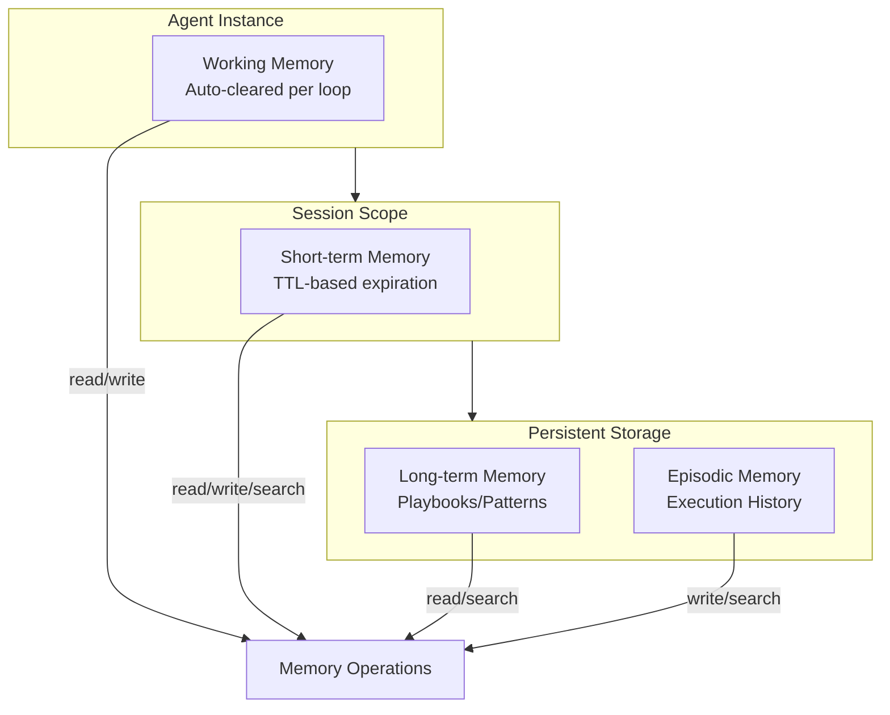
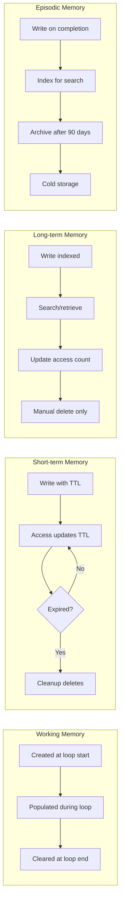

# ECHOMEN Memory Protocol

## Overview

The ECHOMEN Memory Protocol defines a structured, multi-tiered memory architecture that supports autonomous agent operations. It provides clear separation of concerns across different memory scopes with well-defined lifecycles, access patterns, and garbage collection strategies.

## Memory Architecture



## Memory Scopes

### Working Memory

Transient memory for the current execution loop iteration.

| Property | Value |
|----------|-------|
| **Lifetime** | Single loop iteration |
| **Clear Trigger** | Loop completion or error |
| **Storage** | In-memory (RAM) |
| **Max Size** | 10 MB |
| **Access Pattern** | Direct key-value |

**Use Cases:**
- Current goal state
- Perception results
- Decision context
- Action parameters
- Temporary computations

```typescript
interface WorkingMemory {
  loopId: string;
  goal: Goal;
  perception: Perception;
  decision: Decision;
  execution: ExecutionState;
  observation: Observation;
  reflection: Reflection;
}
```

### Short-term Memory

Session-scoped memory with TTL-based expiration.

| Property | Value |
|----------|-------|
| **Lifetime** | Session duration (default 1 hour) |
| **Clear Trigger** | TTL expiration or session end |
| **Storage** | Redis / In-memory with persistence |
| **Max Size** | 100 MB |
| **Access Pattern** | Key-value + search |

**Use Cases:**
- Conversation history
- Recent tool results
- Intermediate task states
- User preferences (session)
- Cached API responses

```typescript
interface ShortTermMemory {
  sessionId: string;
  entries: STMEntry[];
  createdAt: number;
  expiresAt: number;
}

interface STMEntry {
  key: string;
  value: any;
  ttl: number;
  createdAt: number;
  accessedAt: number;
  accessCount: number;
}
```

### Long-term Memory

Persistent storage for learned patterns and playbooks.

| Property | Value |
|----------|-------|
| **Lifetime** | Indefinite (until explicit deletion) |
| **Clear Trigger** | Manual deletion only |
| **Storage** | Firebase Firestore / IndexedDB |
| **Max Size** | 1 GB |
| **Access Pattern** | Search + key-value |

**Use Cases:**
- Task playbooks
- Learned patterns
- Tool usage statistics
- Success/failure patterns
- Domain knowledge

```typescript
interface LongTermMemory {
  entries: LTMEntry[];
}

interface LTMEntry {
  id: string;
  type: 'playbook' | 'pattern' | 'knowledge' | 'statistic';
  key: string;
  value: any;
  metadata: {
    createdAt: number;
    updatedAt: number;
    accessCount: number;
    successRate?: number;
    tags: string[];
    embedding?: number[]; // For semantic search
  };
}
```

### Episodic Memory

Indexed history of task executions for learning and audit.

| Property | Value |
|----------|-------|
| **Lifetime** | Indefinite (archivable) |
| **Clear Trigger** | Archive policy (e.g., >90 days) |
| **Storage** | Firebase Firestore + Cold Storage |
| **Max Size** | 10 GB |
| **Access Pattern** | Indexed search |

**Use Cases:**
- Task execution records
- Outcome tracking
- Learning data
- Audit trail
- Performance metrics

```typescript
interface EpisodicMemory {
  episodes: Episode[];
}

interface Episode {
  id: string;
  taskId: string;
  goal: Goal;
  executionTrace: LoopState[];
  outcome: 'success' | 'partial' | 'failure';
  duration: number;
  iterations: number;
  toolsUsed: string[];
  memoryUpdates: MemoryUpdate[];
  lessonsLearned: Lesson[];
  timestamp: number;
  indexedBy: {
    outcome: string;
    tools: string[];
    duration: 'short' | 'medium' | 'long';
    complexity: number;
  };
}
```

## Memory Operations API

### Core Operations

```typescript
interface MemoryManager {
  /**
   * Write a value to the specified memory scope
   */
  write<T>(
    scope: MemoryScope,
    key: string,
    value: T,
    options?: WriteOptions
  ): Promise<void>;

  /**
   * Read a value from the specified memory scope
   */
  read<T>(
    scope: MemoryScope,
    key: string,
    options?: ReadOptions
  ): Promise<T | null>;

  /**
   * Search within a memory scope using query
   */
  search<T>(
    scope: MemoryScope,
    query: SearchQuery,
    options?: SearchOptions
  ): Promise<MemoryMatch<T>[]>;

  /**
   * Clear all entries in a memory scope
   */
  clear(scope: MemoryScope, filter?: ClearFilter): Promise<void>;

  /**
   * Delete a specific key from a memory scope
   */
  delete(scope: MemoryScope, key: string): Promise<void>;

  /**
   * Check if a key exists in a memory scope
   */
  exists(scope: MemoryScope, key: string): Promise<boolean>;

  /**
   * Run garbage collection on expired entries
   */
  cleanup(options?: CleanupOptions): Promise<CleanupResult>;
}
```

### Type Definitions

```typescript
type MemoryScope = 'working' | 'short-term' | 'long-term' | 'episodic';

interface WriteOptions {
  ttl?: number;           // Time-to-live in milliseconds
  overwrite?: boolean;    // Allow overwriting existing key
  encrypt?: boolean;      // Encrypt sensitive data
  index?: boolean;        // Index for search (long-term/episodic)
  tags?: string[];        // Tags for categorization
}

interface ReadOptions {
  decrypt?: boolean;      // Decrypt if encrypted
  includeMetadata?: boolean; // Include metadata in response
}

interface SearchQuery {
  text?: string;          // Full-text search
  filters?: Record<string, any>; // Field filters
  embedding?: number[];   // Semantic search vector
  tags?: string[];        // Tag filters
}

interface SearchOptions {
  limit?: number;         // Max results (default: 10)
  offset?: number;        // Pagination offset
  sortBy?: 'relevance' | 'recency' | 'accessCount';
  sortOrder?: 'asc' | 'desc';
}

interface MemoryMatch<T> {
  key: string;
  value: T;
  score: number;          // Relevance score (0-1)
  metadata?: MemoryMetadata;
}

interface ClearFilter {
  olderThan?: number;     // Clear entries older than timestamp
  tags?: string[];        // Clear entries with specific tags
  type?: string;          // Clear entries of specific type
}

interface CleanupOptions {
  scope?: MemoryScope;    // Specific scope or all
  dryRun?: boolean;       // Report without deleting
  threshold?: number;     // TTL threshold for cleanup
}

interface CleanupResult {
  deleted: number;
  archived: number;
  errors: CleanupError[];
  duration: number;
}
```

## Read/Write Patterns

### Basic Operations

```typescript
// Write to working memory (auto-cleared per loop)
await memory.write('working', 'currentGoal', goal);

// Write to short-term memory with TTL
await memory.write('short-term', 'userPreference', prefs, {
  ttl: 3600_000, // 1 hour
  tags: ['preferences', 'ui']
});

// Write to long-term memory (indexed for search)
await memory.write('long-term', 'playbook:web-scraping', playbook, {
  index: true,
  tags: ['playbook', 'web', 'scraping'],
  overwrite: true
});

// Write to episodic memory (execution record)
await memory.write('episodic', `episode:${taskId}`, episode, {
  index: true,
  tags: ['execution', outcome]
});

// Read from memory
const goal = await memory.read<Goal>('working', 'currentGoal');
const prefs = await memory.read<Preferences>('short-term', 'userPreference');

// Check existence
const hasPlaybook = await memory.exists('long-term', 'playbook:web-scraping');

// Delete specific key
await memory.delete('short-term', 'tempData');
```

### Search Patterns

```typescript
// Full-text search in long-term memory
const playbooks = await memory.search<Playbook>('long-term', {
  text: 'web scraping authentication',
  filters: { type: 'playbook' }
}, {
  limit: 5,
  sortBy: 'relevance'
});

// Semantic search using embeddings
const similarEpisodes = await memory.search<Episode>('episodic', {
  embedding: currentSituationEmbedding,
  filters: { outcome: 'success' }
}, {
  limit: 3,
  sortBy: 'relevance'
});

// Tag-based filtering
const recentPrefs = await memory.search<Preference>('short-term', {
  tags: ['preferences']
}, {
  sortBy: 'recency',
  sortOrder: 'desc'
});

// Combined search
const results = await memory.search<Pattern>('long-term', {
  text: 'error handling',
  tags: ['pattern', 'error'],
  filters: { successRate: { gte: 0.8 } }
}, {
  limit: 10,
  sortBy: 'relevance'
});
```

### Batch Operations

```typescript
// Batch write for efficiency
await Promise.all([
  memory.write('working', 'step1', result1),
  memory.write('working', 'step2', result2),
  memory.write('working', 'step3', result3),
]);

// Transaction-like operations
async function atomicUpdate(
  scope: MemoryScope,
  updates: { key: string; value: any; operation: 'set' | 'delete' }[]
): Promise<void> {
  const results = await Promise.allSettled(
    updates.map(u => 
      u.operation === 'set' 
        ? memory.write(scope, u.key, u.value)
        : memory.delete(scope, u.key)
    )
  );
  
  const failures = results.filter(r => r.status === 'rejected');
  if (failures.length > 0) {
    // Rollback or handle partial failure
    throw new MemoryError('Atomic update failed', { failures });
  }
}
```

## Search & Retrieval Patterns

### Retrieval-Augmented Generation (RAG)

```typescript
interface RAGRetrieval {
  /**
   * Retrieve relevant context for decision making
   */
  async retrieveContext(goal: Goal): Promise<ContextBundle> {
    const [playbooks, episodes, recent] = await Promise.all([
      // Find relevant playbooks
      this.memory.search('long-term', {
        text: goal.description,
        filters: { type: 'playbook' }
      }, { limit: 5 }),
      
      // Find similar past executions
      this.memory.search('episodic', {
        text: goal.description,
        filters: { outcome: 'success' }
      }, { limit: 3 }),
      
      // Get recent session context
      this.memory.search('short-term', {
        tags: ['context', 'session']
      }, { limit: 10, sortBy: 'recency' })
    ]);
    
    return {
      playbooks: playbooks.map(p => p.value),
      similarEpisodes: episodes.map(e => e.value),
      recentContext: recent.map(r => r.value),
      relevanceScores: {
        playbooks: playbooks.map(p => p.score),
        episodes: episodes.map(e => e.score),
        recent: recent.map(r => r.score)
      }
    };
  }
}
```

### Pattern Matching

```typescript
interface PatternMatcher {
  /**
   * Find matching patterns for current situation
   */
  async findMatchingPatterns(
    situation: Situation
  ): Promise<PatternMatch[]> {
    // Search by tags
    const taggedPatterns = await this.memory.search('long-term', {
      tags: situation.tags
    }, { limit: 10 });
    
    // Search by semantic similarity
    const semanticPatterns = await this.memory.search('long-term', {
      embedding: await this.embed(situation.description)
    }, { limit: 10 });
    
    // Search by structural similarity
    const structuralPatterns = await this.memory.search('long-term', {
      filters: {
        preconditions: { $elemMatch: situation.preconditions }
      }
    }, { limit: 10 });
    
    // Combine and rank
    return this.rankPatterns([
      ...taggedPatterns,
      ...semanticPatterns,
      ...structuralPatterns
    ], situation);
  }
}
```

### Learning Retrieval

```typescript
interface LearningRetriever {
  /**
   * Retrieve lessons learned from similar situations
   */
  async retrieveLessons(execution: ExecutionRecord): Promise<Lesson[]> {
    const similarExecutions = await this.memory.search('episodic', {
      filters: {
        toolsUsed: { $overlap: execution.toolsUsed },
        outcome: execution.outcome
      }
    }, { limit: 20 });
    
    // Extract and aggregate lessons
    const lessons = similarExecutions.flatMap(e => e.value.lessonsLearned);
    
    // Group by category and find common themes
    return this.aggregateLessons(lessons);
  }
}
```

## Cleanup & Garbage Collection

### TTL-Based Expiration

```typescript
interface TTLManager {
  /**
   * Check and remove expired entries
   */
  async cleanupExpired(scope: MemoryScope): Promise<number> {
    const now = Date.now();
    let deleted = 0;
    
    if (scope === 'short-term') {
      const entries = await this.getAllEntries('short-term');
      for (const entry of entries) {
        if (entry.expiresAt < now) {
          await this.delete('short-term', entry.key);
          deleted++;
        }
      }
    }
    
    return deleted;
  }
}
```

### LRU Eviction

```typescript
interface LRUEviction {
  /**
   * Evict least recently used entries when memory is full
   */
  async evictLRU(scope: MemoryScope, targetSize: number): Promise<number> {
    const entries = await this.getAllEntries(scope);
    
    // Sort by last access time
    const sorted = entries.sort((a, b) => a.accessedAt - b.accessedAt);
    
    // Calculate how many to evict
    const currentSize = this.calculateSize(entries);
    const toEvict = sorted.slice(0, Math.max(0, currentSize - targetSize));
    
    // Evict
    for (const entry of toEvict) {
      await this.delete(scope, entry.key);
    }
    
    return toEvict.length;
  }
}
```

### Archive Policy

```typescript
interface ArchivePolicy {
  /**
   * Archive old episodic memories to cold storage
   */
  async archiveOldEpisodes(olderThan: number): Promise<ArchiveResult> {
    const oldEpisodes = await this.memory.search('episodic', {
      filters: { timestamp: { lt: olderThan } }
    }, { limit: 1000 });
    
    const archived = [];
    const errors = [];
    
    for (const episode of oldEpisodes) {
      try {
        // Move to cold storage
        await this.coldStorage.write(`episodes/${episode.key}`, episode.value);
        
        // Remove from active storage
        await this.memory.delete('episodic', episode.key);
        
        archived.push(episode.key);
      } catch (error) {
        errors.push({ key: episode.key, error });
      }
    }
    
    return { archived, errors, count: archived.length };
  }
}
```

### Scheduled Cleanup

```typescript
interface CleanupScheduler {
  /**
   * Run periodic cleanup tasks
   */
  startScheduler(): void {
    // Every 5 minutes: cleanup expired short-term memory
    setInterval(async () => {
      await this.memory.cleanup({
        scope: 'short-term',
        threshold: 0
      });
    }, 5 * 60 * 1000);
    
    // Every hour: LRU eviction if needed
    setInterval(async () => {
      await this.memory.cleanup({
        scope: 'short-term',
        threshold: 0.8 // When 80% full
      });
    }, 60 * 60 * 1000);
    
    // Every day: archive old episodes
    setInterval(async () => {
      const ninetyDaysAgo = Date.now() - (90 * 24 * 60 * 60 * 1000);
      await this.archiveOldEpisodes(ninetyDaysAgo);
    }, 24 * 60 * 60 * 1000);
  }
}
```

## Memory Lifecycle



## Integration with Execution Loop

### Memory Operations per State

| Loop State | Memory Reads | Memory Writes |
|------------|--------------|---------------|
| PERCEIVE | working:goal, short-term:context, long-term:playbooks | working:perception |
| REASON | working:perception, long-term:patterns | working:decision |
| ACT | working:decision, short-term:tool-state | working:execution |
| OBSERVE | working:execution | working:observation |
| REFLECT | working:*, episodic:similar | episodic:current, long-term:learnings |

### Example Integration

```typescript
class ExecutionLoop {
  async run(goal: Goal): Promise<ExecutionResult> {
    const loopId = generateId();
    
    try {
      // Initialize working memory
      await this.memory.write('working', 'loopId', loopId);
      await this.memory.write('working', 'goal', goal);
      
      // PERCEIVE
      const context = await this.retrieveContext(goal);
      await this.memory.write('working', 'perception', { context, goal });
      
      // REASON
      const decision = await this.reason(goal, context);
      await this.memory.write('working', 'decision', decision);
      
      // ACT
      const result = await this.execute(decision);
      await this.memory.write('working', 'execution', result);
      
      // OBSERVE
      const observation = await this.observe(result);
      await this.memory.write('working', 'observation', observation);
      
      // REFLECT
      const reflection = await this.reflect(observation, goal);
      
      // Write episodic memory
      await this.memory.write('episodic', `episode:${loopId}`, {
        loopId,
        goal,
        executionTrace: this.getTrace(),
        outcome: reflection.outcome,
        lessonsLearned: reflection.lessons
      });
      
      // Update long-term memory with learnings
      for (const lesson of reflection.lessons) {
        await this.memory.write('long-term', `lesson:${lesson.id}`, lesson, {
          index: true,
          tags: ['lesson', lesson.category]
        });
      }
      
      return reflection;
      
    } finally {
      // Clear working memory
      await this.memory.clear('working');
    }
  }
}
```

## Error Handling

### Memory Errors

```typescript
enum MemoryErrorCode {
  NOT_FOUND = 'MEMORY_NOT_FOUND',
  WRITE_FAILED = 'MEMORY_WRITE_FAILED',
  SEARCH_FAILED = 'MEMORY_SEARCH_FAILED',
  QUOTA_EXCEEDED = 'MEMORY_QUOTA_EXCEEDED',
  CORRUPTION = 'MEMORY_CORRUPTION',
  TIMEOUT = 'MEMORY_TIMEOUT',
}

class MemoryError extends Error {
  constructor(
    message: string,
    public code: MemoryErrorCode,
    public scope?: MemoryScope,
    public key?: string,
    public cause?: Error
  ) {
    super(message);
    this.name = 'MemoryError';
  }
}
```

### Fallback Strategies

```typescript
interface MemoryFallback {
  /**
   * Handle memory read failures gracefully
   */
  async readWithFallback<T>(
    scope: MemoryScope,
    key: string,
    fallback: () => Promise<T>
  ): Promise<T> {
    try {
      const value = await this.memory.read<T>(scope, key);
      if (value !== null) return value;
    } catch (error) {
      if (error instanceof MemoryError) {
        // Log but continue with fallback
        this.logger.warn('Memory read failed, using fallback', {
          scope, key, error
        });
      } else {
        throw error;
      }
    }
    return fallback();
  }
  
  /**
   * Handle write failures with degradation
   */
  async writeWithDegradation<T>(
    scope: MemoryScope,
    key: string,
    value: T,
    options?: WriteOptions
  ): Promise<void> {
    try {
      await this.memory.write(scope, key, value, options);
    } catch (error) {
      if (error.code === MemoryErrorCode.QUOTA_EXCEEDED) {
        // Try to cleanup and retry
        await this.memory.cleanup({ scope });
        await this.memory.write(scope, key, value, options);
      } else if (error.code === MemoryErrorCode.TIMEOUT) {
        // Queue for async write
        await this.writeQueue.enqueue({ scope, key, value, options });
      } else {
        throw error;
      }
    }
  }
}
```

## Performance Considerations

### Caching Strategy

```typescript
interface MemoryCache {
  /**
   * LRU cache for frequently accessed items
   */
  cache: LRUCache<string, any>;
  
  async read<T>(scope: MemoryScope, key: string): Promise<T | null> {
    const cacheKey = `${scope}:${key}`;
    
    // Check cache first
    const cached = this.cache.get(cacheKey);
    if (cached !== undefined) {
      return cached as T;
    }
    
    // Read from storage
    const value = await this.storage.read(scope, key);
    
    // Cache if found
    if (value !== null) {
      this.cache.set(cacheKey, value);
    }
    
    return value;
  }
}
```

### Batch Operations

```typescript
interface BatchOperations {
  /**
   * Batch multiple reads for efficiency
   */
  async batchRead<T>(
    scope: MemoryScope,
    keys: string[]
  ): Promise<Map<string, T>> {
    // Group by storage backend
    const results = new Map<string, T>();
    
    // Parallel fetch
    const fetches = keys.map(async key => {
      const value = await this.memory.read<T>(scope, key);
      if (value !== null) {
        results.set(key, value);
      }
    });
    
    await Promise.all(fetches);
    return results;
  }
}
```

## Version History

| Version | Date | Changes |
|---------|------|---------|
| 1.0.0 | 2026-03-01 | Initial specification |
